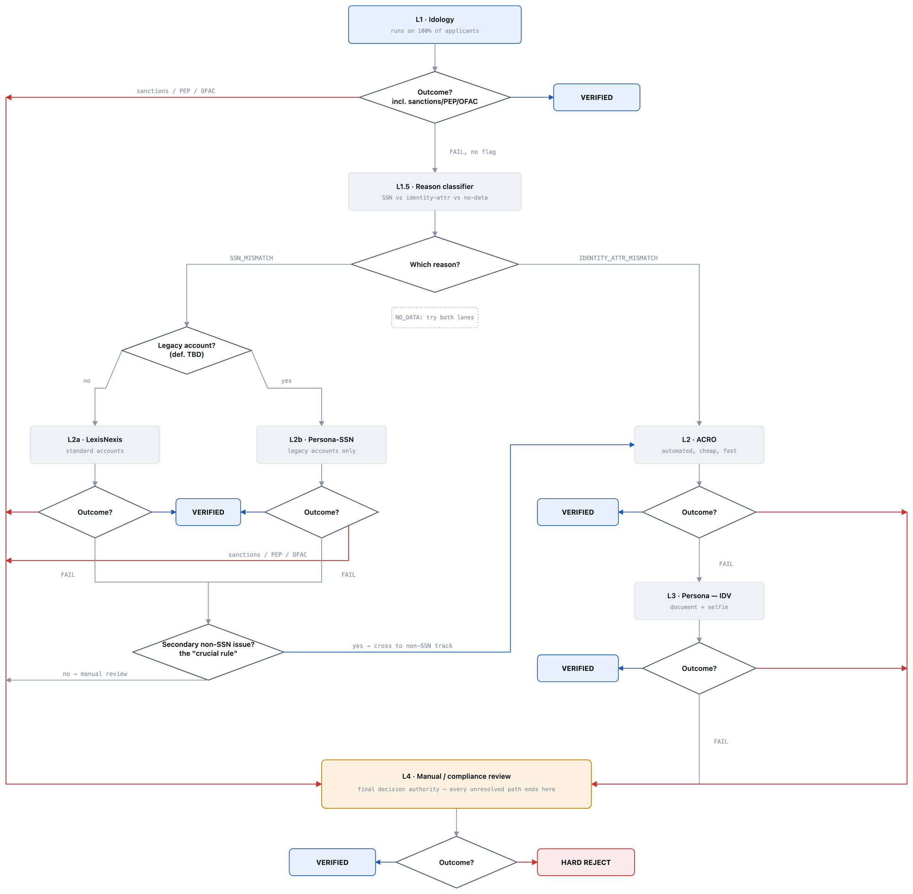

# PRD — KYC Verification Waterfall v2

| | |
|---|---|
| **Document** | Product Requirements Document (1 of 3: PRD · ARD/Monitoring Plan · Project Plan) |
| **Owner** | Product Manager, KYC |
| **Primary audience** | Backend Engineering, Integrations Engineering, Review Ops |
| **Status** | Ready for engineering review |
| **Version / date** | v2.0 — September 2026 |

> **This document is self-contained.** It describes the system as it exists today, what is wrong with
> it, what we are building, and how we ship it. No prior reading is required. Metric definitions and
> instrumentation live in the companion **ARD / Monitoring Plan**; staffing and sequencing live in the
> companion **Project Plan**. Every number here is measured from the production KYC record set
> (2,515,155 applications, enrolled Jan 2023 – May 2026, 107 internal test accounts excluded).

---

## 1. Summary

Every user of our US consumer product must pass identity verification (KYC) before we can open their
account. Verification runs as a **waterfall**: a primary identity provider, then one or more secondary
providers, then a human reviewer. Today **7.93% of applicants end up not verified**, against a 5%
regulatory-and-commercial bar — 199,421 people, of whom roughly 73,663 are over budget.

**The dominant cause is not that people fail checks. It is that the waterfall stops running.**
101,162 applicants (4.02% of the book, **50.7% of all non-verifications**) failed the primary check
and then had **no second check of any kind** — no secondary provider, no human review. Three of them
verified. Applicants who failed the same primary check and *were* routed onward recovered at
**48.09%**.

**v2 makes "stops running" structurally impossible.** Every primary failure is classified into a
reason, every reason has a defined path, and no applicant can leave the system without landing in one
of exactly three terminal states. We are **not** loosening any check, threshold, or standard to hit
the bar; the entire improvement comes from routing.

**Expected outcome: 7.93% → ~6.0%,** with a committed target of **≤6.3%** and a 5.0% stretch (§3
explains why we commit to 6.3% and not 5.0%). **The cost is human review volume: roughly 2.4× today's
case load.** That is the real trade this design makes, and it is what gates the rollout.

---

## 2. The system today

### 2.1 Providers in use

| Tier | Provider | What it checks | Applicant friction |
|---|---|---|---|
| L1 | **Idology** | Primary identity: name, DOB, address, SSN. Also carries our sanctions/PEP screening signal. | None — invisible |
| L2 (SSN path) | **LexisNexis** | Identity + SSN verification. Integrated **twice** (`ProviderA_Lexis_Nexis`, `ProviderB_Lexis_Nexis`), both writing to one result field. | None |
| L2 (SSN path) | **Persona — SSN mode** | SSN verification, documented as the route for "older/legacy accounts". | None |
| L2 (non-SSN path) | **ACRO** | Automated secondary identity check (name / DOB / address / email). | None |
| L3 | **Persona — IDV mode** | Document capture + selfie. Highest assurance. | **High** — 60–120s of active user effort |
| L4 | **Manual review** | Human analyst; final decision authority, including compliance cases. | None (but adds hours–days of wait) |

The field `overall_kyc_status` is the sole record of the final outcome.

### 2.2 The waterfall as documented

1. **L1 Idology.** Pass ⇒ verified, exit. Fail ⇒ log the reason (SSN error vs. non-SSN error) and route on.
2. **L2/L3 split by failure type.**
   - *SSN issue* → LexisNexis (standard accounts) or legacy Persona-SSN (older accounts).
     **Crucial rule:** if that check surfaces a secondary *non-SSN* issue, move the applicant to the non-SSN track.
   - *Non-SSN issue* (name / DOB / address / email) → ACRO or Persona IDV.
3. **L4 Manual review.** If every automated check fails, a human assesses the case.

### 2.3 What the production data actually shows

85.67% of applicants follow the documented design. The remaining 14.33% is where the loss is
concentrated. Five defects, each measured:

| # | Defect | Volume | Verified | Why it matters |
|---|---|---:|---:|---|
| **D1** | **Stranded** — Idology FAIL, then nothing at all ran | **101,162** (4.02%) | **0.003%** | Half of all non-verification. Comparable routed applicants recover at 48.09%. |
| **D2** | **Primary bypassed** — Idology never ran; a LexisNexis integration acted as an undocumented second front door | **94,183** (3.74%) | 99.08% | A control gap: ~3.7% of the book was approved without our primary identity check. |
| **D3** | **PASS did not exit** — clean Idology PASS, yet further checks ran anyway | **131,538** (5.23%) | 99.81% | Mostly wasted spend, but **247 applicants passed the primary check and still ended not verified.** |
| **D4** | **Safety net missed** — automation exhausted, no human ever looked | **48,598** non-verified | 0% | Manual review reached only **30.2%** of the 213,048 applicants who exhausted automation. |
| **D5** | **Sanctions signal is invisible** — sanctions/PEP rides on the same undifferentiated FAIL as an ordinary typo | 9,994 flagged cases | 79.0% cleared | We cannot tell a watchlist hit from an address mismatch at routing time. And **zero** of the 101,162 stranded applicants have any reviewer record, so their risk profile is unobserved. |

### 2.4 Every non-verification, classified

Rule: *two or more checks ran and all failed* = a genuine decline; *one check, then nothing* =
an avoidable process loss.

| Bucket | Applicants | % of non-verified | Reading |
|---|---:|---:|---|
| A — no check ever ran | 843 | 0.4% | Never entered the waterfall |
| B — exactly one check ran, then stopped | 101,325 | 50.8% | D1 |
| C — 2+ checks ran, never reached a human | 48,598 | 24.4% | D4 |
| D — fully assessed including a human, still declined | 48,655 | 24.4% | Working as intended |

**75.6% of non-verification (A+B+C) is process failure, not a correct decision.** Only bucket D — just
under a quarter — is the system doing its job. Bucket D is explicitly **not** a target: we found no way
to shrink it without weakening a control.

### 2.5 Two more measured facts the design leans on

- **The crossover rule works.** 8,605 applicants hit the documented SSN→non-SSN crossover and recover at
  **55.0%** — but only because the right checks happened to fire, not because anything enforces it.
- **Our best tool is barely used.** Persona IDV verifies **86.3%** of the primary-check failures it is
  tried on, versus 30.7% for failures it is not. It ran on **0.87%** of them (2,507 cases).

---

## 3. Goals

Baselines are measured over the full record set; targets are measured at 100% rollout. The metric IDs
(M1, M2, …) are defined in the companion ARD.

| # | Goal | Baseline | Target | Metric |
|---|---|---:|---:|---|
| **G1** | **No applicant exits the waterfall undecided** | 101,162 stranded (4.02%) | **0** | M2 |
| **G2** | Reduce non-verification | 7.93% | **≤6.3%** (5.0% stretch) | M1 |
| **G3** | Every applicant gets the primary check | 94,183 (3.74%) bypassed it | **100% L1 coverage** | M3 |
| **G4** | A clean PASS is final | 131,538 (5.23%) continued past PASS; 247 lost | **0 post-PASS checks** | M4 |
| **G5** | The human backstop actually catches | 30.2% of automation-exhausted reached a human | **100%** | M5 |
| **G6** | Sanctions/PEP is a distinct, fast-routed signal | Folded into a bare FAIL; 0 records on stranded users | **100% routed to compliance, p95 ≤4h** | M7 |
| **G7** | No control is weakened to buy the rate | — | Guardrails within tolerance | G-a, G-b, G-c |

**Why G2 commits to 6.3% and not 5.0%.** The 7.93% → ~6.0% projection applies the observed 48.09%
recovery rate of routed applicants to the stranded population. That is a **comparison-group estimate,
not a measured outcome** — the stranded group never had a second check, so their true recoverability is
unobserved. The residual gap to 5.0% depends on Persona IDV behaving at volume as it does at 0.87% of
volume, and on a risk-based auto-decline layer that does not exist yet. We re-baseline this target on
live data at Phase 3 rather than commit engineering to a number we cannot yet defend.

**One goal works against G2, and we are shipping it anyway.** Retiring the primary-check bypass (G3)
forces 94,183 applicants/window who currently verify at 99.08% to clear a real primary check first.
Some will fail. G3 is a **control fix with a plausibly negative conversion effect**. It ships behind its
own flag and is measured separately (M3b) so the two effects are never confused.

### Non-goals

- Changing any verification standard, threshold, or the definition of a PASS.
- Reducing the genuine-decline floor (bucket D, 48,655).
- Adding vendors. We fix the routing of what we already pay for.

---

## 4. Scope

**In scope**

1. **L1.5 reason classifier** — a deterministic rule layer (not a vendor) that tags every primary-check
   failure with exactly one reason class, plus a separable sanctions/PEP/OFAC flag and a secondary-issue
   signal.
2. **Orchestration rewrite** — mandatory L1, unconditional PASS-exit, guaranteed terminal state, retry
   and timeout handling, one feature flag per behavioural change.
3. **Provider role cleanup** — the two LexisNexis integrations unified into one secondary role (L2a);
   Persona-SSN (L2b) and Persona IDV (L3) exposed as distinct callable tiers; the LexisNexis primary
   entry point removed.
4. **Sanctions/PEP/OFAC split** — an independent flag at **every** tier, not only L1, each with an
   immediate compliance route.
5. **The SSN→non-SSN crossover**, as an explicit branch rather than an emergent behaviour.
6. **Manual review** — routing, capacity model, and full reason/path metadata on every case.
7. **Event log, dashboards, and alerts** (specified in the ARD).
8. **One-time migration** of the existing stranded backlog.

**Out of scope, and why**

| Out | Why |
|---|---|
| Risk-based auto-decline (hard-reject low-risk automated failures without a human) | Needs labelled outcome data that v2 itself will generate. This is the main lever to shrink the manual-review cost — it is a v2.1 fast-follow, deliberately not v1. |
| Shrinking the genuine-decline floor | No evidence it is addressable without weakening a control. |
| New vendors | Fix routing first. |
| Applicant-facing UX rework | Except the Persona IDV hand-off, which v1 must not make worse. |

---

## 5. The v2 design

### 5.1 Tier roles

| Tier | Check | Role in v2 | Change from today |
|---|---|---|---|
| **L1** | Idology | Mandatory primary identity check for **100%** of applicants. Emits identity result **and** a separate sanctions/PEP/OFAC flag. | Closes D2. Sanctions signal is no longer folded into PASS/FAIL. |
| **L1.5** | Reason classifier *(new, internal)* | Maps every non-sanctions L1 FAIL to exactly one of `SSN_MISMATCH`, `IDENTITY_ATTR_MISMATCH`, `NO_DATA`. Also emits the secondary-non-SSN-issue signal that drives the crossover. A sanctions/PEP/OFAC flag from L1 skips L1.5 entirely. | New. Drives all routing below. |
| **L2a** | LexisNexis (single integration) | SSN-path check for **standard** accounts. Also emits a sanctions/PEP/OFAC flag; a hit ⇒ L4 immediately. | Two integrations unified; no longer usable as a primary. |
| **L2b** | Persona — SSN mode | SSN-path check for **legacy** accounts. An *alternative* to L2a, never a chain — each applicant gets exactly one. Also emits a sanctions/PEP/OFAC flag; a hit ⇒ L4 immediately. | Restores the documented standard/legacy split. Gate definition is an open dependency (§8). |
| **L2** | ACRO | Secondary identity-attribute check, and the landing point for the crossover. Also emits a sanctions/PEP/OFAC flag; a hit ⇒ L4 immediately. | Same role, now reliably reached. |
| **L3** | Persona — IDV mode | Highest-assurance automated fallback. Placed **last** on the non-SSN path because it is the most expensive and the only step with real user friction. Also emits a sanctions/PEP/OFAC flag; a hit ⇒ L4 immediately. | Promoted from 0.87% of failures to the standard second non-SSN fallback. |
| **L4** | Manual / compliance review | Two entry points: automation exhausted on the assigned path, or an immediate sanctions/PEP/OFAC route from **any** tier, not only L1. Final decision authority. | Reaching L4 becomes a guarantee, not a possibility. |

### 5.2 Routing rules, in priority order

```
                          ┌──────────────────────────────┐
                          │  L1 — IDOLOGY (100%, no exceptions)  │
                          │  → identity result + sanctions flag  │
                          └───────────────┬──────────────┘
              ┌───────────────────────────┼───────────────────────────┐
     sanctions/PEP flag             PASS, no flag                FAIL, no flag
              │                            │                            │
              ▼                            ▼                            ▼
   ┌────────────────────┐        ┌──────────────────┐      ┌────────────────────────┐
   │ L4 COMPLIANCE      │        │    VERIFIED      │      │ L1.5 REASON CLASSIFIER │
   │ immediate, skips   │        │  flow terminates │      └───────────┬────────────┘
   │ all automation     │        └──────────────────┘                  │
   └─────────┬──────────┘                          ┌──────────────────┼──────────────────┐
     PASS ─► VERIFIED                        SSN_MISMATCH   IDENTITY_ATTR_MISMATCH   NO_DATA
     FAIL ─► HARD REJECT                            │                  │                  │
                                                    ▼                  ▼                  ▼
                                          ┌──────────────────┐  ┌───────────┐  ┌────────────────────┐
                                          │ legacy account?  │  │  L2 ACRO  │  │ applicable SSN chk │
                                          │  yes → L2b       │  └─────┬─────┘  │  + L2 ACRO         │
                                          │  no  → L2a       │   PASS │ FAIL   │  IN PARALLEL       │
                                          │ (exactly one)    │        │        └─────────┬──────────┘
                                          └────────┬─────────┘        ▼         any PASS │ both FAIL
                                             PASS  │  FAIL      ┌───────────┐   ─► VERIFIED   │
                                                   │            │ L3 IDV    │◄────────────────┘
                                        ┌──────────┴──────────┐ └─────┬─────┘
                                        │ secondary non-SSN   │  PASS │ FAIL
                                        │ issue surfaced?     │       ▼
                                        │  yes → non-SSN track│  VERIFIED / L4
                                        │  no  → L4           │
                                        └─────────────────────┘
```

*(Sanctions/PEP/OFAC branches for L2a, L2b, ACRO and IDV omitted above to keep the ASCII tree
readable — each works exactly like L1's. See Figure 1 for the full tree, every branch drawn.)*

1. **L1 runs on every applicant.** No bypass, no exception.
2. **A sanctions/PEP/OFAC flag ⇒ L4 compliance immediately, at any tier** (L1, L2a, L2b, ACRO or
   IDV), skipping every remaining automated fallback. Compliance decides; a FAIL there is a hard
   reject.
3. **Clean PASS with no flag ⇒ VERIFIED, flow terminates.** Nothing downstream may fire. *(Fixes D3.)*
4. **FAIL with no flag ⇒ L1.5 assigns exactly one reason class**, which sets the path:
   - `SSN_MISMATCH` → legacy ? **L2b Persona-SSN** : **L2a LexisNexis** — exactly one, never both.
     PASS ⇒ verified; sanctions/PEP/OFAC ⇒ L4. Otherwise, FAIL ⇒ **crossover check**: a secondary
     non-SSN issue surfaced? Yes → non-SSN track (ACRO → IDV → L4). No → L4.
   - `IDENTITY_ATTR_MISMATCH` → **L2 ACRO** → (FAIL) **L3 IDV** → (FAIL) **L4**. Sanctions/PEP/OFAC
     at either step ⇒ L4.
   - `NO_DATA` → applicable SSN check **and** ACRO in parallel → any PASS verifies; sanctions/PEP/OFAC
     ⇒ L4; both FAIL → **L3 IDV** → (FAIL) **L4**. (Same sanctions rule throughout.)
5. **L4 is the last stop on every path.** PASS ⇒ verified; FAIL ⇒ hard reject.

**Figure 1 — the same tree, every branch drawn.**



### 5.3 Stop conditions

| Terminal state | Reached when | Why it is final |
|---|---|---|
| **VERIFIED** | Any tier returns PASS on the applicant's assigned path, sanctions flag absent or cleared | Symmetric with hard reject — once set, nothing may re-open it |
| **HARD REJECT** | (a) compliance confirms a sanctions/PEP match, or (b) every automated check on the assigned path failed **and** a human declined | (a) is a legal decline, never a routing problem. (b) is the genuine-decline floor. |
| **IN MANUAL REVIEW** | Automation exhausted, or a sanctions/PEP/OFAC flag raised at any tier | Transitional — must resolve to VERIFIED or HARD REJECT |

**Deliberately not a stop condition:** an automated FAIL on its own, at any tier. Every path reaches a
human before a final no. This *strengthens* our control posture relative to today, where 48,598
applicants were declined by automation with no human ever looking.

---

## 6. Functional requirements

Numbered for traceability into tickets and tests. **FR-1, FR-2 and FR-3 are invariants** — assertions
enforced in code and monitored continuously, not best-effort behaviours.

| ID | Requirement |
|---|---|
| **FR-1** | Every application record must, at any point after 72h, be in **exactly one** of `VERIFIED`, `HARD_REJECT`, `IN_MANUAL_REVIEW`. "Failed a check, nothing pending, no decision" must be unrepresentable in the state model. |
| **FR-2** | No application may reach a terminal state without an L1 event. |
| **FR-3** | Once L1 returns PASS with no sanctions flag, no downstream check — automated or manual — may be dispatched for that application. |
| **FR-4** | L1.5 must assign exactly one reason class to every L1 FAIL; unclassifiable failures take `NO_DATA` and its fan-out path. |
| **FR-5** | The sanctions/PEP flag is evaluated independently of the identity result and takes routing precedence over every other class. |
| **FR-6** | On the SSN path, exactly one of L2a / L2b executes per application. |
| **FR-7** | On an SSN-path FAIL, the crossover condition must be evaluated before falling through to L4. |
| **FR-8** | Provider error or timeout is **not** a FAIL. The application parks in a retry queue (3 attempts, exponential backoff, 30-minute window) and escalates to L4 if unresolved. No applicant is rejected because a vendor was down. |
| **FR-9** | Every check attempt and every routing decision emits an immutable event (schema in the ARD). Auditability must not depend on inferring the path from per-provider result columns. |
| **FR-10** | Every L4 case carries the reason class, every provider result, and the full path taken, so the reviewer is not re-deriving what happened. |
| **FR-11** | Each behavioural change — routing engine, PASS-exit, bypass retirement, IDV promotion — sits behind an independent feature flag and can be reverted without reverting the others. |
| **FR-12** | Cohort assignment is a stable hash of the application id. An application never changes cohort mid-flight. |
| **FR-13** | Persona IDV must instrument **invitation, start, and completion separately.** An abandoned IDV must be distinguishable from a decline. |

---

## 7. User flows

### 7.1 Success — ~84.8% of applicants

Submit → **L1 Idology** → clean PASS, no sanctions flag → **VERIFIED**, flow terminates. Latency
unchanged (<1s), no applicant action, no downstream call permitted.

Today 79.57% of applicants take this path cleanly; v2 adds the 5.23% who currently pass and then get
extra checks anyway (D3), bringing it to **84.80%**. This path is untouched in substance and is the
regression risk we watch hardest during rollout.

### 7.2 Error / fallback — the fix

L1 FAIL, no sanctions flag → L1.5 classifies → routed per §5.2.

| Reason class | Path | Applicant experience |
|---|---|---|
| `SSN_MISMATCH` | L2a **or** L2b → crossover check → non-SSN track or L4 | Silent |
| `IDENTITY_ATTR_MISMATCH` | L2 ACRO → L3 IDV → L4 | Silent until L3 |
| `NO_DATA` | SSN check + ACRO in parallel → L3 IDV → L4 | Silent until L3 |

Every check above also screens for sanctions/PEP/OFAC (§5.2 rule 2); a hit routes straight to L4, same
as an L1 hit. Not broken out per-check here — the applicant experience doesn't change, silent either way.

Only **L3 Persona IDV** is visible to the applicant: an in-app prompt for a document photo and a
selfie, 60–120 seconds of effort. It is deliberately last, so anyone who clears at the cheap,
frictionless ACRO step never sees it.

### 7.3 Escalation

- **Sanctions/PEP/OFAC flag, any tier → L4 compliance queue immediately**, p95 ≤4h to queue, ahead of
  all automated fallbacks. Sized for a mostly-false-positive load: of 9,994 flagged cases in the
  baseline, **79.0% cleared**. Compliance decides; FAIL is a hard reject with no appeal path in v1.
  That sizing is the L1-only baseline (§8, A1) — re-baseline once L2a/L2b/ACRO/IDV sanctions volume is
  known.
- **Automation exhausted → L4 identity review queue**, with full case metadata (FR-10).
- **Provider outage → hold, do not decide** (FR-8).
- **Queue breach** — if L4 depth exceeds the phase's capacity model, the rollout ramp halts
  automatically at its current percentage (it does **not** auto-revert; see §9).

### 7.4 Contingency: if the reason classifier cannot be built

The classifier assumes Idology returns structured reason fields. **This is unconfirmed** and is the
single load-bearing assumption in the design (§8). If Idology returns only PASS/FAIL, v1 falls back to
**reasonless fan-out**: on any FAIL, run the applicable SSN-path check and ACRO in parallel, then L3,
then L4 — i.e. the `NO_DATA` path for everyone.

This still delivers G1, G3, G4 and G5. It costs materially more per failed applicant (~2 automated
calls instead of ~1.3) and **loses the sanctions fast-path**, which is the real loss. The decision is
forced in week 2, before any classifier code is written.

---

## 8. Assumptions and open dependencies

| # | Assumption | Status | If it fails |
|---|---|---|---|
| **A1** | Idology's API returns structured reason fields and a separable sanctions/PEP/OFAC flag, **and each of LexisNexis, Persona-SSN, ACRO and Persona-IDV can independently return that same flag** | **Unconfirmed for all five.** Idology is a known vendor-API question; the other four have **zero data evidence** either way — every flagged case in the dataset sits inside an Idology FAIL | Fall back to §7.4 for Idology. Any provider that can't return the flag drops its sanctions branch and reverts to identity-only routing — coverage stays at L1 |
| **A2** | "Legacy account" has an operational definition (a cutover date, product cohort, or explicit flag) | **Undefined.** No signal in our data — age, enrollment vintage and bank partner all fail to reproduce it | Ship v1 routing **all** `SSN_MISMATCH` → L2a, logged as a documented deviation. Add L2b when Account Services can define the gate. |
| **A3** | Manual review capacity can grow ~2.4× on the rollout timeline | Gating constraint — see Project Plan | Ramp slows. Capacity, not code, sets the pace. |
| **A4** | Real provider unit costs and latency SLAs | Not in our data; all cost figures are illustrative unit costs on **real volumes** | Cost thresholds re-set before Phase 2 |
| **A5** | Persona IDV completion holds at 10–20× current volume | Unknown — abandonment today is indistinguishable from decline | FR-13 makes it measurable; IDV ships on its own flag |

---

## 9. Rollout and migration

**The ramp is gated by manual-review capacity, not engineering readiness.** v2 roughly 2.4×'s review
volume (~21,900 → ~51,600 cases/yr; ≈8 additional analyst FTE at illustrative rates). Ramping faster
than hiring converts a routing fix into a queue backlog — a worse applicant experience than the
stranding we are fixing.

| Phase | Traffic | Duration | Entry gate | Exit gate |
|---|---|---|---|---|
| **P0 Shadow** | 100% mirrored, **0% acting** | 2 wks | v2 deployed, dashboards live | Classifier ≥95% agreement with reviewer-labelled ground truth; projected L4 volume within ±20% of model |
| **P1 Canary** | 5% | 2 wks | P0 exit + 2 analysts onboarded | Stranded rate = 0 in cohort; no P1 alerts; L4 turnaround p90 <72h |
| **P2 Ramp** | 25% | 3 wks | +3 analysts | Non-verification in cohort ≤6.5%; IDV completion ≥65%; guardrails flat |
| **P3 Majority** | 50% | 3 wks | +3 analysts; queue turnaround stable | Guardrails within tolerance; **G2 target re-baselined on live data** |
| **P4 Full** | 100% | — | All gates green | Legacy path deleted after 30 days dark |

**Risk controls built into the ramp**

- **Shadow before acting.** P0 runs v2 on all traffic making zero real decisions — the only phase where
  a wrong classifier costs nothing. Given A1, skipping it would be the worst decision available.
- **One flag per change** (FR-11). Bypass retirement in particular is *expected* to cost verification
  rate; bundled with the routing fix it would mask a genuine win.
- **Halt, do not auto-revert.** An unresolved P1 alert freezes the ramp at its current percentage.
  Rollback is a human decision — flipping routing mid-application is its own failure mode. The legacy
  path stays warm through P4.
- **A control cohort survives to P4.** The metric that decides whether v2 was right is
  post-verification fraud rate, and it lags 90 days. Cutting to 100% early destroys the comparison.
- **Sticky randomisation** by application-id hash (FR-12).

**Migration**

- **Stranded backlog.** The 101,162 existing stranded applicants are a live liability, not history.
  Re-run them through v2 in batches, oldest first, throttled to **≤20% of daily review capacity**,
  starting after P2. Re-consent and notification copy owned by Compliance and Legal before batch one.
  At the 48.09% comparison recovery rate this is the largest single recovery in the programme — and
  the one most likely to swamp the queue if run unthrottled. Its recoveries are reported separately
  from the steady-state rate.
- **Data migration: none destructive.** v2 writes a new append-only decision-event log alongside the
  existing result columns. Legacy columns keep being written through P4, so every dashboard has a
  continuous series across the cutover, and a daily reconciliation job compares the two.

---

## 10. Glossary

| Term | Meaning |
|---|---|
| **Waterfall** | The ordered sequence of identity checks: primary → secondary → human |
| **Stranded** | An application with a failed check, nothing pending, and no decision — the defect v2 eliminates |
| **Reason class** | One of `SANCTIONS_HIT`, `SSN_MISMATCH`, `IDENTITY_ATTR_MISMATCH`, `NO_DATA` |
| **Crossover** | The documented rule moving an applicant from the SSN track to the non-SSN track when an SSN-path check surfaces a non-SSN issue |
| **PEP** | Politically Exposed Person — a screening category requiring enhanced due diligence |
| **Terminal state** | `VERIFIED`, `HARD_REJECT`, or `IN_MANUAL_REVIEW` |
| **Guardrail** | A metric proving we did not buy conversion by weakening a control |
